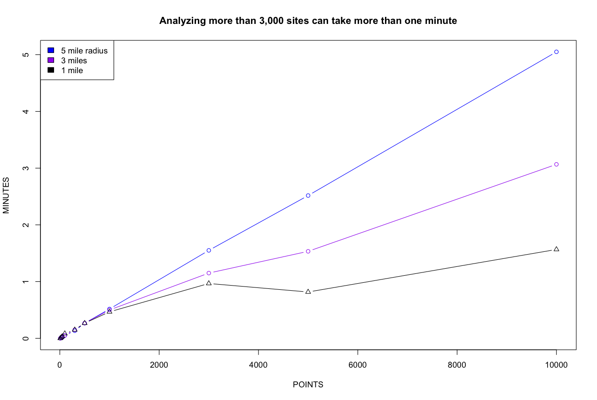
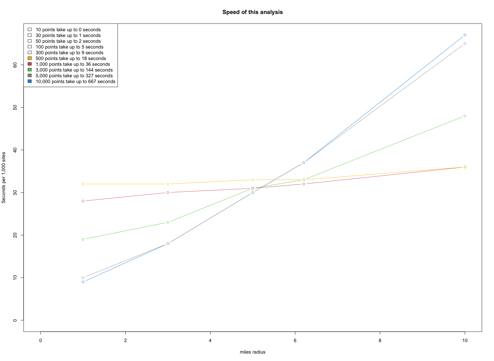
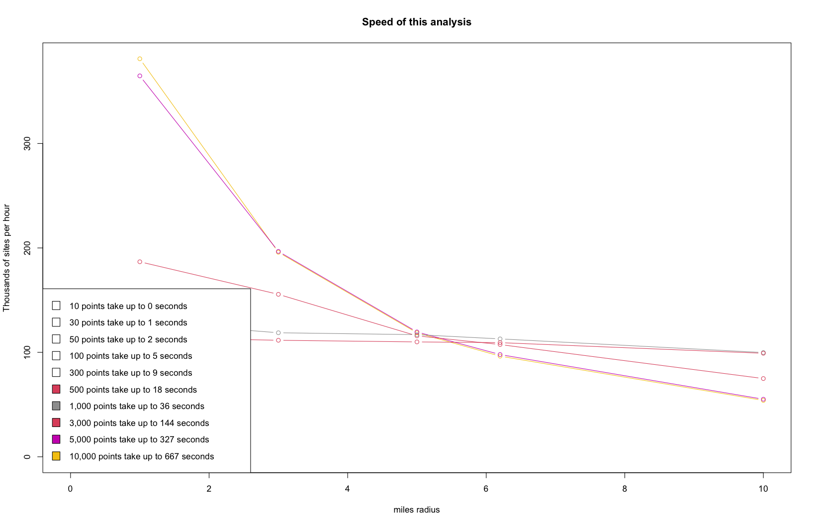

```{r developernote, eval=FALSE, echo= FALSE, include = FALSE}
#  *>>>>>>>>>> Developer note: vignettes need to be tested/edited/rebuilt regularly <<<<<<<<<<<*
#    - **See ?pkgdown::build_site** and script in EJAM/data-raw/- EJAM uses the pkgdown R package to build help and articles/ vignettes as web pages
```

```{r SETUP-default-eval-or-not, include = FALSE}
knitr::opts_chunk$set(
  collapse = TRUE,
  comment = "#>"
)
```

```{r libraryEJAM, eval = FALSE, echo= FALSE, include= FALSE}
# rm(list = ls()); golem::detach_all_attached(); devtools::load_all()

if (!exists("blockgroupstats")) {library(EJAM)} # use installed version only if pkg not yet attached

dataload_dynamic('all') # varnames = all  currently means all defined by .arrow_ds_names

indexblocks()
```

## How to Check the Speed of the Overall Analysis

EJAM is designed to provide results for large numbers of sites very quickly, 
so it can analyze well over 100,000 sites per hour,
and can analyze 1,000 sites within 30 seconds
while analyzing >3,000 sites can take longer than 1 minute.
This is assuming it has already been initialized with loaded data and indexing blocks
when the package is loaded and attached, which needs to be done once up front and can take a minute.

Some relevant EJAM functions:

-   `EJAM:::speedreport()`
-   `EJAM:::speedmessage()`
-   `EJAM:::speedtest()`
-   `EJAM:::speedtest_plot()`
-   `EJAM:::speedtable_summarize()`
-   `EJAM:::speedtable_expand()`

Note some of these are internal, not exported, so you would need to use EJAM:::
if using them without doing load_all() first.

Analyzing a few points takes a few seconds, and 
analyzing residents within 1 to 3 miles of 3,000 points may take approximately one minute.
Ten thousand sites with a radius of 5 miles at each can take about 5 minutes.

```{r points_speedreport, eval=FALSE, echo=TRUE}
began = Sys.time()
x = ejamit(testpoints_100, radius = 1)
ended = Sys.time()
EJAM:::speedreport(start = began, end = ended, n = 100)

## Rate of 34,314 places per hour: 100 places took 10 seconds
```

Analyzing all 159 counties in Georgia can take less than 10 seconds.
Analyzing all of the 3,222 US Counties may take one to two minutes.

```{r counties_speedreport, eval=FALSE}
allcounties <- fips_counties_from_state_abbrev(stateinfo$ST)
began = Sys.time()
y = ejamit(fips = allcounties)
ended = Sys.time()
EJAM:::speedreport(start = began, end = ended, n = length(allcounties))

## Counties:
## Rate of 124,477 places per hour: 3,222 places took 93 seconds
```

Analyzing 20 cities can take 20 seconds, for example, depending on the cities.
Analyzing 200 cities may take more than one minute.

```{r cities-speedreport, eval=FALSE}
n <- 200
set.seed(1)
cities_sample <- sample(censusplaces$fips, n)
began = Sys.time()
y = ejamit(fips = cities_sample)
ended = Sys.time()
EJAM:::speedreport(start = began, end = ended, n = length(cities_sample))

## Cities, including time to download city boundaries:
## Rate of 3,807 places per hour: 20 places took 19 seconds
## Rate of 9,662 places per hour: 200 places took 75 seconds (less if cached)
```


## Speed Varies by Radius and Number of Points

You can automate running various scenarios with the speedtest() utility:

```{r speedtest2, eval = FALSE, echo = TRUE, fig.height=3.6, fig.width=7.2}
# Run the analysis at each distance for each count of sites
# (note this example could take an hour to run all these scenarios)
point_counts = c(10, 30, 50, 100, 300, 500, 1000, 3000, 5000, 10000)
radii = c(1, 3, 5, 6.2, 10)
speeds <- EJAM:::speedtest(n = point_counts, radii = radii)

# If you want a CSV of detailed timings for runtime modeling, including
# small-point cases like 1, 2, and 10 points:
speeds_detailed <- EJAM:::speedtest(
  n = point_counts,
  radii = radii,
  collect_detailed = TRUE,
  detail_point_counts = c(1, 2, 10),
  detailed_csv = "data-raw/Analysis_timing_results_runtime_models.csv",
  logging = FALSE,
  plot = FALSE,
  honk_when_ready = FALSE
)
detailed_rows <- attr(speeds_detailed, "detailed_results")
```

The runtime models should be trained separately for the main input modes:
point buffers, FIPS Census units, and uploaded polygons. Point-buffer runs use
radius as an important predictor, but FIPS and polygon runs do not have the
same meaning of radius. To collect one combined timing table with an
`analysis_type` column, use:

```{r speedtest-scenarios, eval = FALSE, echo = TRUE}
scenario_speeds <- EJAM:::speedtest_runtime_scenarios() # uses defaults

scenario_rows <- attr(scenario_speeds, "detailed_results")
```

The combined detailed table includes `analysis_type` and `analysis_subtype`.
For FIPS runs, the subtype is based on `fipstype(fips)`, so city/place FIPS and
county FIPS can be modeled separately. The default county scenario uses up to
25 California county FIPS codes, the default city scenario uses up to 25
`censusplaces$fips` values, and the default polygon scenario uses the Portland
example shapefile in `inst/testdata/shapes/portland_folder_shp/`. You can
provide different FIPS vectors or a different shapefile if you want the timing
data to reflect another expected workload.

For small numbers of points, the radius and number of points do not have a large impact on total time, 
but for larger radius values the number of points matters more. Likewise, for larger numbers of points,
the radius starts to have a bigger impact on time required. You can see this in plots below, where
the lines are steeper for the larger radius values or for the larger counts of points.


### Time Needed

```{r time-needed, eval=FALSE, fig.height=3.6, fig.width=7.2}
# Time Needed
plot(speeds$points[speeds$miles == 5], speeds$seconds[speeds$miles == 5]/60, 
     type = "b", col="blue", 
     xlab="POINTS", ylab="MINUTES", 
     main = "Analyzing >3,000 sites can take >1 minute")
points(speeds$points[speeds$miles == 3], speeds$seconds[speeds$miles == 3]/60, 
       type = "b", col = "purple")
points(speeds$points[speeds$miles == 1], speeds$seconds[speeds$miles == 1]/60, 
       type = "b", pch= 2, col = "black")
legend("topleft", 
       legend = c("5 mile radius", "3 miles", "1 mile"), 
       fill = c("blue", "purple", "black"))
```

{width="7in"}


### Time per Site

```{r time-per-site, eval=FALSE, fig.height=3.6, fig.width=7.2}
# Time per Site
EJAM:::speedtest_plot(speeds, secondsperthousand = T)
```

{width="7in"}


### Rate (Sites per Hour)

```{r rate, eval=FALSE, fig.height=3.6, fig.width=7.2}
# Rate (Sites per Hour)
EJAM:::speedtest_plot(speeds)
```

{width="7in"}


### Detailed Results

```{r speedtest3, eval = FALSE, echo = TRUE, fig.height=3, fig.width=5}

speeds[order(speeds$points, speeds$miles), ]

## Rate of > 100,000 buffers per hour for radius < 10 miles

#    points miles  perhr perminute persecond minutes seconds secondsper1000

# 1   10000  10.0  53978       900        15      11     667             67
# 2   10000   6.2  96384      1606        27       6     374             37
# 3   10000   5.0 118704      1978        33       5     303             30
# 4   10000   3.0 195848      3264        54       3     184             18
# 5   10000   1.0 381144      6352       106       2      94              9

# 6    5000  10.0  55108       918        15       5     327             65
# 7    5000   6.2  97906      1632        27       3     184             37
# 8    5000   5.0 119570      1993        33       3     151             30
# 9    5000   3.0 196675      3278        55       2      92             18
# 10   5000   1.0 364759      6079       101       1      49             10

# 11   3000  10.0  74921      1249        21       2     144             48
# 12   3000   6.2 107501      1792        30       2     100             33
# 13   3000   5.0 115810      1930        32       2      93             31
# 14   3000   3.0 155565      2593        43       1      69             23
# 15   3000   1.0 186745      3112        52       1      58             19

# 16   1000  10.0  99832      1664        28       1      36             36
# 17   1000   6.2 112894      1882        31       1      32             32
# 18   1000   5.0 116952      1949        32       1      31             31
# 19   1000   3.0 118768      1979        33       1      30             30
# 20   1000   1.0 129210      2154        36       0      28             28

# 21    500  10.0  99125      1652        28       0      18             36
# 22    500   6.2 109329      1822        30       0      16             33
# 23    500   5.0 110006      1833        31       0      16             33
# 24    500   3.0 111581      1860        31       0      16             32
# 25    500   1.0 114241      1904        32       0      16             32

# 26    300  10.0 126853      2114        35       0       9             28
# 27    300   6.2 126675      2111        35       0       9             28
# 28    300   5.0 127537      2126        35       0       8             28
# 29    300   3.0 126101      2102        35       0       9             29
# 30    300   1.0 119889      1998        33       0       9             30

# 31    100  10.0 128512      2142        36       0       3             28
# 32    100   6.2 113519      1892        32       0       3             32
# 33    100   5.0 130490      2175        36       0       3             28
# 34    100   3.0 129807      2163        36       0       3             28
# 35    100   1.0  77091      1285        21       0       5             47

# 36     50  10.0 120906      2015        34       0       1             30
# 37     50   6.2 124448      2074        35       0       1             29
# 38     50   5.0 120663      2011        34       0       1             30
# 39     50   3.0 119094      1985        33       0       2             30
# 40     50   1.0  99968      1666        28       0       2             36

# 41     30  10.0 118980      1983        33       0       1             30
# 42     30   6.2 119238      1987        33       0       1             30
# 43     30   5.0 121354      2023        34       0       1             30
# 44     30   3.0 120427      2007        33       0       1             30
# 45     30   1.0 121601      2027        34       0       1             30

# 46     10  10.0 100006      1667        28       0       0             36
# 47     10   6.2  99464      1658        28       0       0             36
# 48     10   5.0  97472      1625        27       0       0             37
# 49     10   3.0  95221      1587        26       0       0             38
# 50     10   1.0  95564      1593        27       0       0             38

```
